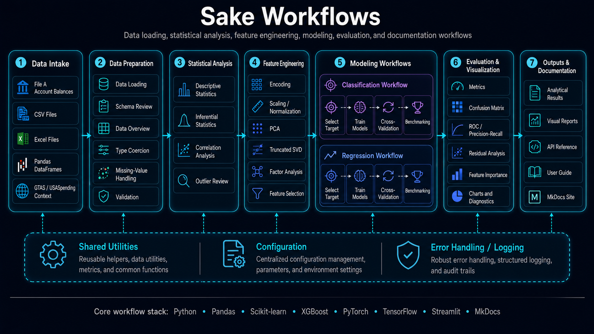

___

## 🧭 Purpose

The Sake user guide provides the operating instructions for the application’s end-to-end analytics workflow: install the environment, load budget execution data, inspect data quality, run descriptive and inferential statistics, engineer model-ready features, train classification and regression models, and review visualization outputs.

Sake is designed around a conventional analytical workflow. It starts with source data, validates that data, transforms it into an analysis-ready form, applies statistical or machine-learning methods, and then presents outputs that can be reviewed, compared, and explained.

## 🧱 Workflow Overview

| Stage | User Activity | Output |
|---|---|---|
| Installation | Prepare Python, dependencies, and runtime environment. | Working local environment or notebook runtime. |
| Data Loading | Load CSV, Excel, File A Account Balances, or DataFrame inputs. | Initial analytical dataset. |
| Data Overview | Review shape, schema, missing values, and distributions. | Data quality profile. |
| Descriptive Statistics | Summarize central tendency, spread, skew, and outliers. | Statistical baseline. |
| Inferential Statistics | Test relationships, differences, and significance. | Evidence for relationships or group differences. |
| Feature Engineering | Prepare numeric, categorical, and reduced-dimension features. | Model-ready feature matrix. |
| Classification | Train and evaluate categorical prediction models. | Classification metrics and diagnostics. |
| Regression | Train and evaluate numeric prediction models. | Regression metrics and diagnostics. |
| Visualization | Review charts and diagnostics. | Interpretable analytical outputs. |
| Streamlit App | Run the interactive application. | Browser-based analysis workflow. |

## 🔄 Recommended Sequence

Use this sequence for a complete analysis cycle:

1. Install dependencies.
2. Launch the Streamlit application or notebook.
3. Load the dataset.
4. Confirm the schema and data types.
5. Review missing values and outliers.
6. Run descriptive statistics.
7. Run inferential statistics when group comparisons or relationships matter.
8. Engineer features for machine learning.
9. Train classification or regression models.
10. Compare model metrics and diagnostic plots.
11. Document assumptions, limitations, and validation results.

## 🏛️ Budget Execution Context

Sake is especially useful for budget execution analytics where the data contains Treasury Account Symbol structure, budgetary resources, obligations, outlays, recoveries, balances, or account classifications. The same workflow can also support general tabular machine-learning datasets when the target and features are clearly defined.

## ✅ Minimum Inputs

At minimum, an analysis-ready dataset should include:

| Requirement | Description |
|---|---|
| Rows | Observations, accounts, reporting periods, or records. |
| Columns | Numeric and categorical variables available for analysis. |
| Target variable | Required for supervised classification or regression. |
| Metadata | Optional fields such as account code, agency, period, classification, or availability. |

## 🧪 Common Use Cases

| Use Case | Description |
|---|---|
| Account balance profiling | Review distributions, missing values, and high-risk accounts. |
| Budget execution analysis | Compare obligations, outlays, resources, and balances. |
| Model benchmarking | Compare multiple algorithms against common metrics. |
| Feature exploration | Test whether transformations or dimensionality reduction improve results. |
| Teaching and prototyping | Demonstrate classical statistics, machine learning, and diagnostics. |

## 🔗 Related Pages

| Page | Use |
|---|---|
| [Installation](installation.md) | Prepare the runtime environment. |
| [Data Loading](data-loading.md) | Load CSV, Excel, and DataFrame inputs. |
| [Data Overview](data-overview.md) | Inspect data quality and structure. |
| [Feature Engineering](feature-engineering.md) | Prepare model-ready features. |
| [Classification](classification.md) | Train categorical prediction models. |
| [Regression](regression.md) | Train numeric prediction models. |
| [Visualization](visualization.md) | Interpret plots and diagnostics. |
| [Streamlit App](streamlit-app.md) | Use the browser interface. |
